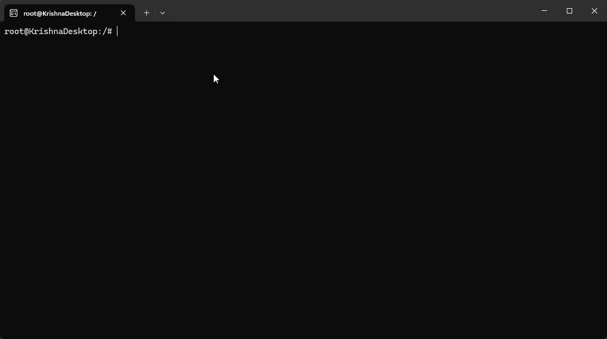

# Hermes Navigator
An alternative to 'ls' and 'cd' for Linux.  
Inspired by this [Digital Maker Video](https://www.youtube.com/watch?v=jvrDEKDhdB8).  
The Hermes Navigator isn't particularly efficient at moving to known and frequently visited directories, nor is it intended to be. If you already know the directory you need to go to, using `cd` is the fastest.  
However, Hermes is intended to give you an efficient way to explore new directories with minimal keyboard inputs.

## Demonstration


## Usage
After following the installation instructions below, you can use it anywhere by running this command:
```
hermes
```
This will store the state of your terminal, and show all the directories and files in the current directory. The directories are at the top half of the output, and the files are on the bottom half. Each directory has a key associated with it, which you can press to navigate there. Once you get to where you need to go, simply exit out by hitting `q` and the program will change your current working directory to where you navigated to, and restore your terminal from before.

Here is a mapping of the default controls except the navigation keys:
```
q - Exit the program at the current directory.
w - Move up one directory to the parent.
[ - If applicable, display the last page of directories.
] - If there are over 20 directories, display the next page.
; - If applicable, display the last page of files.
' - If there are over 20 files, display the next page.
```

## Installation
Run these commands to install Hermes:
```
chmod +x install.sh
sudo bash install.sh
source ~/.bashrc
```

## Uninstallation
Run these commands to uninstall Hermes:
```
chmod +x uninstall.sh
sudo bash uninstall.sh
source ~/.bashrc
```

## Configuration
My personal devices use Windows, and have Windows Subsystem for Linux installed for dev work. I use Linux through the small command prompt sized window WSL starts in; the spacings and layout of the program (by default) are designed for this window size. If you wish to change the spacing between contents or even the controls of the program, you can edit the defines at the top of `hermes.c`.  
Running the installation commands after any edits will automatically compile and place the edited program in the correct locations such that you can start using it right away.

Here is a description of all defines at the top of the source file:
```
MAX_NAME_LEN       - The internal max length the program uses, must be larger than MAX_DISPLAY_LEN.
MAX_DISPLAY_LEN    - The max length of any item displayed, items with logner names will be truncated.
COLUMN_WIDTH       - The spacing between the output columns, should be larger than MAX_DISPLAY_LEN.
PAGE_SIZE          - The number of items to display per page, should be an even number.
NAV_KEYMAP         - All the keys used for navigating, the length of this must match PAGE_SIZE.
EXIT_KEY           - The key used to exit the program at the current directory.
PARENT_KEY         - The key used to move up one directory, to the parent directory.
PREV_PAGE_DIR_KEY  - The key used to display the previous page of directories.
NEXT_PAGE_DIR_KEY  - The key used to display the next page of directories.
PREV_PAGE_FILE_KEY - The key used to display the previous page of files.
NEXT_PAGE_FILE_KEY - The key used to display the next page of files.
```

## Porting the Program
This program was made for bash. If you want to port the program for something else, you can write your own script that calls the program and reads the output file after executiong; reference hermes.sh to see how the program's lifecycle works. I made the bash script because if I ran the program from the terminal, it runs in a subprocess and changing the directory from inside the program will not affect the parent terminal. Therefore, the program writes the final directory to a temporary output file, which a script will need to read and change directories to from the parent terminal (for bash, this can be done by running a script with the `source` prefix).